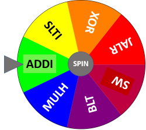

# rv32gen 

**rv32gen** is a basic *"put together in a weekend"* Risc-V 32bits Pseudo Random Instruction Generator. 

**rv32gen** can be used to generate Risc-V test cases which can be used to find bugs in a Risc-V design and/or to execute code and functional coverage on simulators.

There are a few of these generators available on the web but they either use overly complicated UVM/SV frameworks or they don't constrain the branch/memory accesses.

The **rv32gen** program is very basic and consist of a single C and header file. I did not add a lot of options as it is easier to just hack the code to your requirements.

The program was developed to allow me to run code and functional coverage on my Risc-v design but interestingly it found a new bug even though it passes the Risc-v IMC compliance test and a bunch of compiled C tests.

What **rv32gen** generated was:
```
    DIVU zero,s0,s1
```
this failed on my design in a spectacular way in that it managed to write to x0. It is unlikely this instruction will be in any of my embedded code but this might not always be the case.
 
The program generate pseudo random instructions including load/store and jumps.  The load/store instructions are constrained to +/-2047 locations around a **base address** which can be specified on the command line (-sb). The jump/branch instructions are constrained to jump to a location a few instructions later or earlier in the test program. 

## Requirements
1) gcc compiler

## Build process

gcc rv32gen.c -o rv32gen.exe

## Usage

```
rv32gen -help

*** RV32GEN Ver 0.2 (c)2022 HT-LAB ***

Usage               : genriscv <options> <output_filename>

Options:
-q                  : Quiet, must be specified first in the options list
-s <integer>        : Set randomize seed, default seed=time()
-march <string>     : Generate instructions for architecture, default to "IMC"
-ebreak             : include ebreak opcodes, default excluded
-ecall              : include ecall opcodes, default excluded
-ic <hex>           : Instruction Count, default to 512 (2KByte)
-sb <hex>           : Set load/store Base address, default to 0x1000
```

### Option -q
This will disable all output messages and is useful if **rv32gen** is used in a regression environment.

### Option -s
The default seed uses the current time(), if you want to have repeatable results then you can set the seed to a constant value using the -s option. Note that if you use the program in a regression environment without specifying the seed then the time between 
calling **rv32gen** must be larger than 1 seconds otherwise you will end up with the same testcase. The used seed is
printed in the output source file.
```
# RV32GEN, ver 0,2
# march=imc
# ebreak is Excluded
# ecall is Excluded
# Seed used 1666167107

main:   SUB     t1,s2,zero # Start Pseudo Random Instruction Test
```
### Option -march
Not yet used but you can use it to generate just 32I (-march I) instructions, mul/div instructions 32M (-march M) or the default
32IM (-march IM). 

For compressed "RVC" test cases simply assemble the generated code with:

```
<your riscv setup>-gcc -c -Os -mabi=ilp32 -march=rv32imc -ffreestanding -nostdlib ran0.S
```

| gcc -march=rv32im                  | gcc -march=rv32imc                 |
| :--------------------------------- | :--------------------------------- |
| <code>01a8a5b3  slt   a1,a7,s10   </code> | <code>01a8a5b3  slt   a1,a7,s10   </code> |
| <code>00001337  lui   t1,0x1      </code> | <code>----6305  lui   t1,0x1      </code> |
| <code>593c0c37  lui   s8,0x593c0  </code> | <code>593c0c37  lui   s8,0x593c0  </code> |
| <code>78831a03  lh    s4,1928(t1) </code> | <code>78831a03  lh    s4,1928(t1) </code> |
| <code>000016b7  lui   a3,0x1      </code> | <code>----6685  lui   a3,0x1      </code> |
| <code>0028bb33  sltu  s6,a7,sp    </code> | <code>0028bb33  sltu  s6,a7,sp    </code> |
| <code>ebc69523  sh    t3,-342(a3) </code> | <code>ebc69523  sh    t3,-342(a3) </code> |
| <code>6e793713  sltiu a4,s2,1767  </code> | <code>6e793713  sltiu a4,s2,1767  </code> |
| <code>00c0006f  j     82e0 <jf13> </code> | <code>----a021  j     82a2 <jf13> </code> |

If you never want compressed code you can include the generated file in a wrapper with the ".option norvc" option.
```
.option norvc
.include ran0.S
```

### Option -ebreak\-ecall
By default ebreak\ecall (and efence) are not included in the generated code. If you specify -ebreak and/or -ecall then they will be included. 
Note the generated code always ends with an ebreak instruction.

### Option -ic
Number of instruction to generate, defaults to 512 (2Kbyte).

### Option -sb
Set the base address for load/store instructions. The generated load/store sequence first load the base address into a random register. 
It then issues a load/store with a random offset from -2027 to +2047.

## Example

rv32gen ran0.S -ic 0x1ff0 -s 1

```
# RV32GEN, ver 0.2
# march=imc
# ebreak is Excluded
# ecall is Excluded
# Seed used 1666167107

main:   SUB     t1,s2,zero # Start Pseudo Random Instruction Test
        ORI     s1,t0, 626
        BGE     s7,t1,jf0   # Test jump forwards
        SLTI    a2,ra,-1040
jf0:    MUL     s4,t4,a4
        ORI     a3,s6,-238
        SLTIU   s7,s9,-390
        LUI     t4,4096>>12 # Load/Store base address
        SLL     s7,s6,s3
        LW      t2,680(t4)
        SLTIU   s10,s6,-1116
        SLTU    s10,t4,t4
        SRAI    s9,s5,12
        SLL     a6,a0,t3
        OR      s0,gp,gp
        SRLI    s4,tp,28
        LUI     t5,4096>>12 # Load/Store base address
        OR      tp,t5,a2
        LH      ra,1362(t5)
        LUI     a2,4096>>12 # Load/Store base address
        SLTI    a4,s4,-2026
        SH      s6,-1034(a2)
        AND     s10,a7,a4
        XORI    t6,t1,-561
        J       jf1
jb1:    LUI     s11,0x18bc0
        J       js1
jf1:    ADDI    t5,s9,-924
        BNE     s11,a5,jb1  # Test jump backwards
js1:    ORI     t1,a0, 1874
        LUI     ra,4096>>12 # Load/Store base address
        ADD     a5,t5,t1
        SB      gp,-1481(ra)
        SLTU    s2,a6,t4
        BEQ     t5,a0,jf2   # Test jump forwards
        MULHSU  t6,a0,t6
        ...
        ...
jb679:  MULHU   s0,t3,ra
        J       js679
jf679:  SLL     s3,t0,s6
        BLT     a5,tp,jb679 # Test jump backwards
js679:  MUL     a2,a3,s11
        ebreak  # End of Test       
```